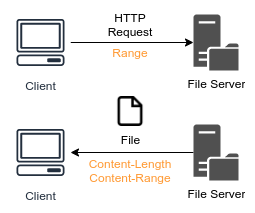
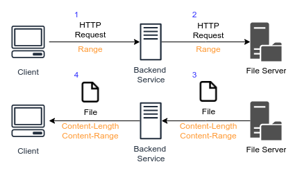
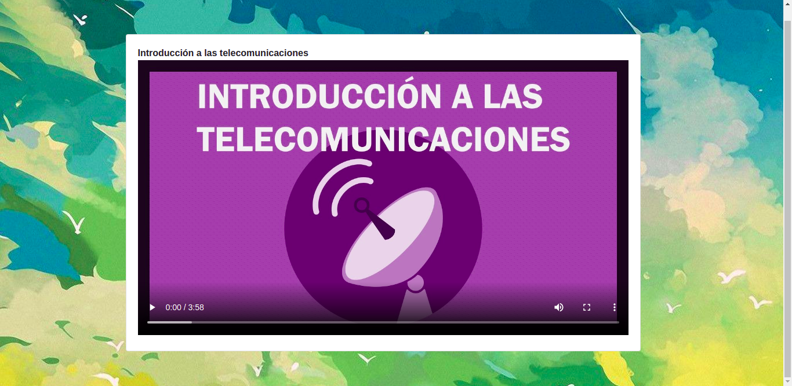

# **StreamOnLive_SOL**

# [DOCUMENTACION PDF](doc/DOCUMENTACION.pdf)
# **INDICE**
- [INTRODUCCIÓN](#id1)
- [ENFOQUE DEL SISTEMA](#id2)
- [SERVICIO DE STREAMING (SOL)](#id3)
- [DIAGRAMA PRINCIPAL DEL SERVIDOR](#id4)
- [CONFIGURACIÓN DEL SERVIDOR PRINCIPAL](#id5)
  - [INSTALACIÓN DEL DOCKER](#id5.1)
- [ARQUITECTURA DE LA APLICACION](#id20)
  - [CONTENIDO PARCIAL HTTP 206](#id21)
  - [ARQUITECTURA](#id22)
- [STREAM ON LIVE (SOL FRONTEND)](#id7)
  - [DEFINICION DE LA APLICACION](#id7.1)
  - [CONFIGURACIÓN DEL NGINX EN ANGULAR](#id7.2)
  - [CONFIGURACIÓN PARA LA CREACIÓN DE LA IMAGEN DEL FRONTEND EN DOCKER](#id7.3)
  - [COMPONENTE PARA LA TRASMISIÓN EN VIVO](#id7.4)
  - [COMANDO NECESARIO PARA CREAR LA IMAGEN Y PARA INICIAR LA IMAGEN](#id7.5)
    - [COMANDO PARA CREAR LA IMAGEN](#id7.6)
    - [COMANDO PARA INICIAR LA IMAGEN](#id7.7)
  - [GITHUB ACTIONS DEL SERVIDOR DEL FRONTEND](#id7.9)
- [STREAM ON LIVE (SOL BACKEND)](#id8)
  - [DEFINICIÓN DE LOS QUE HACE LA APLICACIÓN](#id8.1)
  - [CONTROLADOR PRINCIPAL DE LA TRANSMISION POR DEMANDA](#id8.11)
  - [CONFIGURACIÓN PARA LA CREACIÓN DE LA IMAGEN DEL BACKEND EN DOCKER](#id8.2)
  - [COMANDO NECESARIO PARA CREAR LA IMAGEN Y PARA LEVANTAR LA IMAGEN](#id8.3)
    - [COMANDO PARA CREAR LA IMAGEN](#id8.4)
    - [COMANDO PARA INICIAR LA IMAGEN](#id8.5)
  - [GITHUB ACTIONS DEL SERVIDOR DEL BACKEND](#id8.7)
- [CONCLUSIONES](#id10)
- [RECOMENDACIONES](#id11)

# **INTRODUCCIÓN** <a name="id1"></a>
Las telecomunicaciones y las tecnologías de la información cumplen un rol crucial en nuestros sistemas sociales, económicos y políticos. Por medio de las telecomunicaciones se ha facilitado enormemente la vida cotidiana, permitiendo entrar en contacto con personas de la comunidad y del mundo entero, de manera fácil y rápida. El auge de estas tecnologías, especialmente del Internet, constituye una revolución del conocimiento. Actualmente casi cualquier persona puede acceder a información confiable y directa, y las puertas del saber están abiertas para cada vez más personas. La posibilidad que nos ofrecen las telecomunicaciones para intercambiar información es aprovechada por las distintas empresas para ampliar sus mercados más allá del país en el que se encuentran. La globalización a gran escala que se ve hoy en día no sería posible de no ser por la ubicuidad de los factores de producción y de los mercados que estas tecnologías permiten. Hoy en día es más fácil que nunca realizar una transferencia de dinero de un continente a otro, por ejemplo. Igualmente, cualquier persona con acceso a Internet puede adquirir productos que se ofrezcan en otro lugar del planeta, y recibirlos por medio de los diferentes servicios de encomiendas.

# **ENFOQUE DEL SISTEMA** <a name="id2"></a>
Esta aplicación tiene como objetivo crear un servicio de video por demanda (Video on Demand, VoD) este es un servicio de contenido multimedia que es capaz de distribuir a un monitor de TV individual o computador, en el momento que lo solicita el usuario, ya sea una película, videos informativos o cualquier programa de video localizado en una gran base de datos alojada en un servidor central, permitiendo su control interactivo. El servidor contará con una API REST para intercambiar datos entre el servidor y los clientes. Nos permitirá registrar usuarios, subir videos que estarán disponibles para los usuarios. El servidor será desarrollado en Node.js y utilizará una base de datos SQL para la persistencia de los datos. El cliente será una página web hecha con Angular. La página será capaz de adaptarse a cualquier pantalla. De igual forma también se usará el servidor NGINX como servidor web y proxy inverso. Al escribirla con Angular también podemos llevar nuestra aplicación en un futuro al escritorio o a los móviles haciendo uso de frameworks como Electron o Ionic.


# **CONFIGURACION DEL SERVIDOR PRINCIPAL** <a name="id5"></a>
Para el ejemplo de un servidor de streaming se usara el proveedor en la nube DigitalOcean, en cual se usara uno de sus servicios llamada Droplets, en cual podra acceder a digitalOcean con el siguiente enlace: [DigitalOcean](https://www.digitalocean.com/)

  - ## **INSTALACION DE DOCKER** <a name="id5.1"></a>
      En el caso para facilitar el despliegue de las aplicaciones se usara Docker en cual podrá acceder al siguiente enlace para la instalación(Ubuntu): [Docker](https://www.digitalocean.com/community/tutorials/como-instalar-y-usar-docker-en-ubuntu-18-04-1-es)

# **ARQUITECTURA DE LA APLICACION**
## **CONTENIDO PARCIAL HTTP 206**
El contenido parcial HTTP 206 es básicamente un código de respuesta de estado de éxito que indica que la solicitud se ha realizado correctamente y que el cuerpo contiene los rangos de datos solicitados, como se describe en el encabezado Rango de la solicitud.

En cual hay que estabelecer una seria de encabezados para que el contenido parcial funcione correctamente:

- **Range:** enviado desde el cliente web para solicitar un rango de datos del contenido. Ejemplo: "Range: bytes = 0-10000"

- **Content-Length:** para que el cliente web sepa cuánto se envía la longitud total del contenido en función de la solicitud. En el ejemplo del rango anterior, el resultado será "Content-Length: 10000"

- **Content-Range:** Para conocer el rango de datos del contenido que se envía desde el servidor y también la longitud del contenido total del recurso. Ejemplo: "Content-Range: bytes 0-10000 / 2445339" Esto muestra que el servidor está respondiendo con 10000 bytes de datos, pero el total de datos que se pueden enviar es de hasta 2445339 bytes.

Cuando se habla de transmisión de video, todavía es posible implementarlo incluso sin usar contenido parcial HTTP siempre que el encabezado "Content-Disposition" no esté presente dentro del encabezado de respuesta. Pero buscar una determinada parte del video será imposible ya que la solicitud enviada será respondida con todo el video comenzando por el inicio del archivo.
Pero si el encabezado Range está presente durante una solicitud del cliente, el servidor podría responder a través del contenido parcial HTTP 206 ya que el servidor conoce exactamente con parte de los datos que el cliente necesita. Esto podría hacer que los usuarios salten directamente al minuto X del video siempre que el servidor lo admita.


## **ARQUITECTURA**
El cliente envía directamente una solicitud HTTP al servidor de archivos, ya que el cliente espera una respuesta de contenido parcial **(Status code 206)**, se agrega el encabezado del rango y el servidor responde con el fragmento de datos solicitado junto con los encabezados Content-Length y Content-Range.




Un servidor de archivos generalmente se construye en una instancia separada para que múltiples servicios del backend que están expuestos a clientes web puedan acceder a los mismos recursos. entonces se tomara el siguiente planteamiento de la arquitectura



- El cliente web solicita el servicio de backend para el archivo de video.
- Solicitudes de servicio de backend al servidor de archivos según el archivo solicitado.
- El servidor de archivos responde con el archivo al servicio de backend.
- El servicio de backend envía el archivo recibido como respuesta al cliente web.

El servicio de backend actúa como un proxy donde se reenvían los encabezados del cliente o del servidor. Esto es para asegurarse de que los datos que se envían al cliente sean exactamente los mismos que se reciben del servidor de archivos. Por lo tanto, una buena práctica al crear el servicio de backend es que no debe descargar todo el archivo del servidor de archivos, sino solo transmitir los datos solicitados.

# **STREAM ON LIVE (SOL FRONTEND)**<a name="id7"></a>
Para la parte de la visualizacion se creó una aplicación en angular para llevar todo el manejo y visualización de los videos en transmision por demanda que se este viendo actualmente, así como las conexiones necesarias para que todo funcione y que el usuario pueda interactuar con todas las funcionalidades que ofrece el sistema.

  ## **DEFINICION DE LA APLICACION**<a name="id7.1"></a>
  
   La aplicacion muestra una pagina principal donde se encuentran todos los videos disponibles para visualizarlos y verlos en tiempo real y por demanda, también se encuentra una opción para poder subir videos, donde se registrará el nombre, una portada y el propio video. para que los demas usuarios puedan verlos y asi tambien un apartado para poder visualizar dichos videos

  

  

  

  
  
  ## **CONFIGURACION DEL NGINX EN ANGULAR**<a name="id7.2"></a>

  Después de que se cree la aplicación base lo siguiente que se debe de realizar es la conexión del servidor NGINX a la aplicación.
  Se crea en la ruta principal del proyecto una carpeta con el nombre nginx y dentro de ella crear un documento nginx.conf donde colocaremos toda la configuración del servidor.

  

  El contenido de nginx.conf es el siguiente.
  ```nginx
  server {
    # Se establece el puerto del servidor, que será el puerto 80. Luego se tablece la ruta de la aplicación. ambién con la  instrucción try_files se redirecciona a una ruta en caso de que la principal no sea encontrada y de esta manera evitar que resulte en una solicitud con 404.
    listen 80; 
    location / {
      root   /usr/share/nginx/html;
      index  index.html index.htm;
      try_files $uri $uri/ /index.html;
    }

    # Luego se colocan los encabezados de seguridad para poder establecer los parámetros que son válidos y los que no. Cada uno de los encabezados que se van a configurar le dice al navegador que puede aplicar ciertas restricciones de seguridad a la página, con el fin de mitigar amenazas particulares.
    add_header X-Frame-Options DENY always;
    add_header X-Content-Type-Options  nosniff always;

    # Por último, se establecen el rango de errores que puede poseer la aplicación y la ruta que se usará cuando ocurra algún error.
    error_page   500 502 503 504  /50x.html;
    location = /50x.html {
      root   /usr/share/nginx/html;
    }
  }
  ```  
  ## **CONFIGURACION PARA LA CREACION DE LA IMAGEN EN DOCKER**<a name="id7.3"></a>
  Se creará en la raíz del proyecto de angular un archivo llamado *Dockerfile* que contendrá la configuración para indicarle a Docker cuales son las instrucciones necesarias para crear la imagen.


  El contenido del Dockerfile es el siguiente.
  ```Dockerfile
  FROM nginx:1.18.0-alpine # Primero se coloca la imagen que se utilizará, que es una imagen de NGINX.
  COPY dist/live /usr/share/nginx/html #Luego se colocará el comando para copiar el código de la aplicación en la carpeta del servidor.
  RUN rm /etc/nginx/conf.d/default.conf #Posteriormente se colocará el comando que eliminará el documento de configuración por defecto de NGINX.
  COPY nginx/nginx.conf /etc/nginx/conf.d #Luego se copiará la configuración realizada anteriormente en la ruta establecida.
  EXPOSE 443 # Se establecerá el puerto de la aplicación.
  CMD ["nginx","-g","daemon off;"] #Por último, se colocará el comando que inicia el servicio de NGINX y se indicará que el proceso en segundo plano estará desactivado.
  ```

  ## **COMANDO NECESARIO PARA CREAR LA IMAGEN Y PARA INICIAR LA IMAGEN**<a name="id7.5"></a>
  - ### **COMANDO PARA CREAR LA IMAGEN** <a name="id7.6"></a>
  ```
  $ docker build -t “cloud.canister.io:5000/msmarcks/sol:latest” .
  ```
  - ### **COMANDO PARA INICIAR LA IMAGEN** <a name="id7.7"></a>
  ```
  $ docker run --name “sol” -p “80:80” -d cloud.canister.io:5000/msmarcks/sol:latest
  ```

# **GITHUB ACTIONS DEL SERVIDOR DE FRONTEND**<a name="id7.9"></a>

Aquí debe asignarle nombre al GitHub Actions, que en este caso es de front-server-live.yaml
```yaml
name: front server live
on: # En esta parte, está el encabezado de la información sobre el GitHub Actions.
push: # Y cuando exista un cambio en el main es donde se ejecutará el GitHub Actions en este caso en la rama main, es decir cuando se apruebe un pull request.
    branches: [main]
    paths:  # Aquí debe indicar en que carpeta-proyecto se tomara para realizar el GitHub Actions para el encapsulamiento del código.
      - "live/**"
jobs: # En esta parte se debe hacer el encapsulamiento de la subida de toda la información al servidor.
  integrate:
  runs-on: ubuntu-latest # Aquí es cuando la imagen esta sobre un Ubuntu y este se encarga de agarrar la última versión de Ubuntu.
  steps: 
    - uses: actions/checkout@v2 # Toma la versión más reciente de los GitHub Actions.
    - uses: actions/setup-node@v2 # Toma la última versión del Nodejs.
    - run: docker login -u ${{secrets.USERNAME_CANISTER}} -p ${{secrets.PASSWORD_CANISTER}} cloud.canister.io:5000 # Aquí se deben colocar las credenciales de la imagen del Docker tomando las variables secretas del GitHub y esto se puede considerar que son como las variables de entorno.
    - run: cd live && npm install && npm run package && docker build -t "cloud.canister.io:5000/msmarcks/sol:latest" . # Hace el empaquetamiento de la aplicación.
    - run: docker push cloud.canister.io:5000/msmarcks/sol:latest # Y en esta parte se encarga de subir todo lo que fue empaquetado a la dirección del server.
    - name: andrewtwydell/ssh
      uses: AndrewTwydell/ssh-workflow@1.0.0
      # se realizo la conexion al servidor mediante el host, username y el password mediante los secretos de github
      with:
        # SSH Host
        host: ${{ secrets.SSH_HOST }} 
        # User name
        user: ${{ secrets.SSH_USERNAME }}
        # User Password
        password: ${{ secrets.PASSWORD_SSH }}
        # en cual primero inicia sesion en el repositorio privado de imagenes de docker, posteriormente verifica si un contenedor de la imagen esta activa para posteriormente eliminarla y colocar la nueva imagen en linea para su actualizacion
        script: | 
        docker login -u ${{secrets.USERNAME_REPO}} -p ${{secrets.PASSWORD_REPO}} cloud.canister.io:5000
        docker ps -a -q --filter "name=frontapplive" | grep -q . && docker stop frontapplive && docker rm -fv frontapplive && docker image rm cloud.canister.io:5000/msmarcks/sol:latest || echo ""
        docker run --name frontapplive -p "80:80" -d cloud.canister.io:5000/msmarcks/sol:latest
        exit      
```

# **STREAM ON LIVE (SOL BACKEND)**<a name="id8"></a>

  ## **DEFINICION DE LA APLICACION** <a name="id8.1"></a>
  El orquestador sera el encargado de darle la logica funcional al sistema y de la misma manera realizara la comunicación con el servidor.
  ## **CONTROLADOR PRINCIPAL DE LA TRANSMISION POR DEMANDA**<a name="id8.11"></a>
  ```js
  'use strict';// se establece el el modo estricto para evitar errores de escritura durante el codigo
  import path from "path"; // se importara el modulo path, para manejar las rutas de los documentos 
  import fs from "fs"; // se importara el modulo fs, para manejar los documentos para leerlos, escribir o manipular cualquier informacion
  import db from "../../../config/db"; // se importara el modulo de la base de datos

  class ControllerLive {
      static async SearchDataVideo(req, res) {
          let id = parseInt(req.params.id); // se obtiene el id del video actual
          const videoInfo = db.db[1].find(video => video.id === id); // se busca la informacion del video dentro de la base de datos
          if (!videoInfo) { // en dado caso que el video no existe envia un mensaje que indica que no se encontro el vidoe
              res.json({ message: "none" });
              return;
          }
          const videoPath = path.join(path.resolve(".", "media", videoInfo.src)); // en dado caso si encuentra el video, se guardara en una constante la ruta abosuluta del vidoe
          const videoStat = fs.statSync(videoPath); // en cual se recuperara todos los metadatos del video, como los minutos, el tamaño, u otra informacion relevante que sea necesaria
          const videoSize = videoStat.size; // se guarda en una constante el tamanño en bytes del video
          const videoRange = req.headers.range; // en dado caso la aplicacion del frontend ya ha estado solicitando fragmento del video, entonces se establecera en encabezado range para indicar que fragmento del video se esta transfiriendo a la aplicacion del frontend
          if (videoRange) { // en el dado caso que ya se hubiera solicitado entonces se procedera en entrar
              const parts = videoRange.replace(/bytes=/, "").split("-"); // se obitene el inicio del byte del encabezado
              const start = parseInt(parts[0], 10); // se convierte en un entero para poder operarlo
              const end = (start + 204800) > videoSize ? (videoSize - 1) : (start + 204800); // se estable el final del fragmento a enviar, en dado que si supera al tamaño del video se envira el tamaño del video completo
              const chunksize = (end - start) + 1; // se guarda en una constate el tamaño del fragmento que enviara dicho servidor
              const file = fs.createReadStream(videoPath, { start, end }); // se establece una constante para enviar dicho fragmento a la pagina del frontend

              // se establece los encabezados de la peticion, 
              // en la cual se debe de establecer que se pueda aceptar rangos en la peticion
              // tambien se debe de estabelecer que fragmento de enviara en esta peticion 

              const head = {
                  'Content-Range': `bytes ${start}-${end}/${videoSize}`,
                  'Accept-Ranges': 'bytes',
                  'Content-Length': chunksize,
                  'Content-Type': 'video/mp4',
              };

              res.writeHead(206, head);// en cual se establecera el envio de la peticion, recalcando en el codigo de estado que es el 206 que sin establecer este codigo de estado no podra funcionar la transmion en demanda porque el codigo 206 indica que Partial Content que indica que es una peticon Partial Content y no completa , en cual el navegador cliente debera de estar solicitando distintas peticiones para recuperar todo documento
              file.pipe(res);// en cual para crear la transmion de los datos de fragmentos se debera de crear un pipe "una tuberia" par para poder crear la transimion de los datos fluidamente 
          } else { // en dado la peticion no trae el fragmento que quiere obtener
              // se establece el encabezado de la peticion
              const head = {
                  'Content-Length': videoSize,
                  'Content-Type': 'video/mp4',
              };
              // en cual se establece la conexion inical con estado de estado de 200 con el encabezado
              res.writeHead(200, head);
              // creando una tuber para transimir por fragmento pero establecidos por el sistema hacia la palicacion web
              fs.createReadStream(videoPath).pipe(res);
          }
      }
  }
  export default ControllerLive;
  ```
  ## **CONFIGURACION PARA LA CREACION DE LA IMAGEN DEL BACKEND EN DOCKER** <a name="id8.2"></a>
  Se creara el archivo Docker en la raiz del proyecto de backend el cual tendra el nombre de *Dockerfile* dicho archivo contendra la configuración para darle las instrucciones a Docker de cuales seran las instrucciones necesarias para crear la imagen.
  
  El contenido del Dockerfile es el siguiente.
  ```Dockerfile
 FROM node:14.17-alpine # Primero se coloca la imagen que se utilizará, que es una imagen de NODEJS.
WORKDIR /app #   Despues se usara el comando para establecer el directorio de trabajo para las instrucciones siguientes
COPY . /app/ #  Luego se colocará el comando para copiar el código de la aplicación en la carpeta del servidor.
RUN npm install # posteriormente se colocará el comando que instalara los paquetes de nodeJS 
RUN npm start # Se colocara el comando para iniciar el servidor
COPY . /app/ # Luego se copiará la configuración realizada anteriormente en la ruta establecida.
EXPOSE 3000 # Se establecerá el puerto de la aplicación.
CMD ["node","build/server.js"] #   Por último, se colocará el comando que inicia el servicio del servidor del orquestador y se dara la instruccion de que el proceso en segundo plano estará desactivado.
  ```

  ## **COMANDOS NECESARIOS PARA CREAR LA IMAGEN E INICIAR LA IMAGEN**<a name="id8.3"></a>
  - ### **COMANDO PARA CREAR LA IMAGEN** <a name="id8.4"></a>
  ```
  $ docker build -t “cloud.canister.io:5000/msmarcks/back:latest” .
  ```
  - ### **CCOMANDO PARA INICIAR LA IMAGEN** <a name="id8.5"></a>
  ```
  $ docker run --name “backend” -p “3000:3000” -d cloud.canister.io:5000/msmarcks/back:latest
  ```
# **GITHUB ACTIONS DEL BACKEND** <a name="id8.7"></a>
Aquí debe asignarle nombre al GitHub Actions, que en este caso es de back-server-live.yaml
```yaml
name: back server live
on: # En esta parte, está el encabezado de la información sobre el GitHub Actions
 push: # Y cuando exista un cambio en el main es donde se ejecutará el GitHub Actions en este caso en la rama main, es decir cuando se apruebe un pull request.
    branches: [main]
    paths: # Aquí indica en que carpeta-proyecto se tomara para realizar el GitHub Actions para el encapsulamiento del código.
      - "orquestador/**"
jobs: # En esta parte se hace el encapsulamiento de la subida de toda la información al servidor.
  integrate: 
    runs-on: ubuntu-latest # Aquí es cuando la imagen esta sobre un Ubuntu y este se encarga de agarrar la última versión de Ubuntu.
    steps:
      - uses: actions/checkout@v2  # Toma la versión más reciente de los GitHub Actions.
      - uses: actions/setup-node@v2  # Toma la última versión del Nodejs.
      - run: docker login -u ${{secrets.USERNAME_CANISTER}} -p ${{secrets.PASSWORD_CANISTER}} cloud.canister.io:5000  # Aquí se deben colocar las credenciales de la imagen del Docker tomando las variables secretas del GitHub y esto se puede considerar que son como las variables de entorno.
      - run: cd orquestador && docker build -t "cloud.canister.io:5000/msmarcks/back:latest" . # Hace el empaquetamiento de la aplicación.
      - run: docker push cloud.canister.io:5000/msmarcks/back:latest # Y en esta parte se encarga de subir todo lo que fue empaquetado a la dirección del server.
      - name: andrewtwydell/ssh
        uses: AndrewTwydell/ssh-workflow@1.0.0
         # se realizo la conexion al servidor mediante el host, username y el password mediante los secretos de github
        with:
          # SSH Host
          host: ${{ secrets.SSH_HOST }}
          # User name
          user: ${{ secrets.SSH_USERNAME }}
          # User Password
          password: ${{ secrets.PASSWORD_SSH }}
           # en cual primero inicia sesion en el repositorio privado de imagenes de docker, posteriormente verifica si un contenedor de la imagen esta activa para posteriormente eliminarla y colocar la nueva imagen en linea para su actualizacion
          script: | 
            docker login -u ${{secrets.USERNAME_REPO}} -p ${{secrets.PASSWORD_REPO}} cloud.canister.io:5000
            docker ps -a -q --filter "name=backapplive" | grep -q . && docker stop backapplive && docker rm -fv backapplive && docker image rm cloud.canister.io:5000/msmarcks/back:latest || echo ""
            docker run --name backapplive -p "3333:3000" -e "KEY_TOKEN=DKCngTbQ0IzUMvqEto4ucxPHkPMrhXPsIkj6hsXDCjNb64zI9JyScaeW6fJ7SH8TResT5DUdnFsYbcRkzC35wRsYDuqe0yxaFNSVohPp1sHPP6seS88VB7y1gPMTsTZP" -e "TIME_PARTITION_CHUNK=102400" -d cloud.canister.io:5000/msmarcks/back:latest
            exit
```
# **CONCLUSIONES** <a name="id10"></a>
- En la actualidad gracias al gran avance que ha tenido la tecnología; cualquier empresa, negocio o grupo social puede realizar su propio servicio de videos por demanda, en donde es posible intercambiar ideas, conceptos o simplemente para comunicarse en la cual todo esto es posible gracias a las herramientas desarrolladas por terceros para facilitar su implementación.

- Las telecomunicaciones han avanzado de tal manera haciendo la vida más sencilla con sus implementaciones, las cuales han sido un logro para la humanidad, lo que facilita la comunicación y compartir información. 

# **RECOMENDACIONES** <a name="id11"></a>
- Para el uso adecuado de las telecomunicaciones se debe de poseer un grado de experiencia en dicho ámbito y más para gestionar un canal de comunicación para que sea transparente y seguro para la vía libre de información por ello es recomendable aprender a gestionar y mantener en marcha dicho sistemas de telecomunicaciones.

- En el caso que desean gestionar un sistema de gran escala deberán de aprender herramientas de autogestión, autobalance para que no se sobrecargue dichas aplicaciones y su funcionamiento estén en óptimas condiciones.