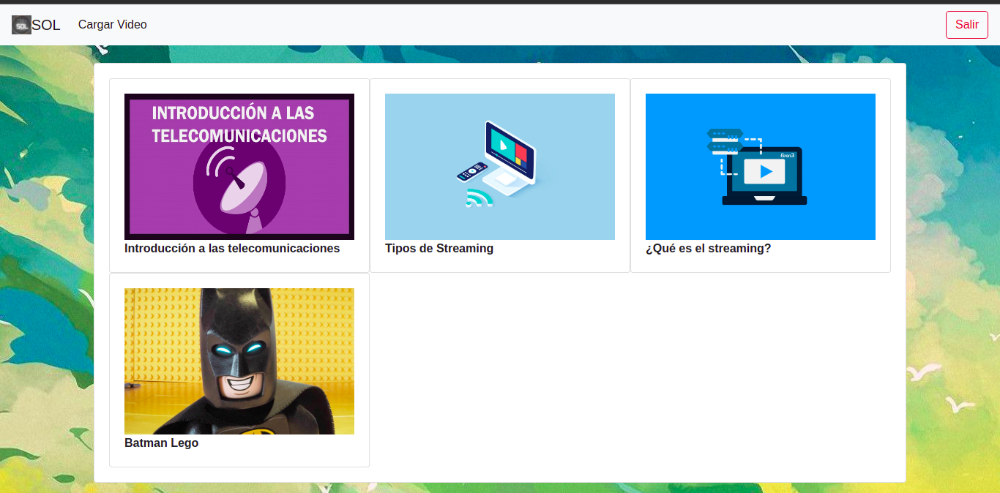

# StreamOnLive_SOL
# **INDICE**
- [INTRODUCCIÓN](#id1)
- [ENFOQUE DEL SISTEMA](#id2)
- [SERVICIO DE STREAMING (SOL)](#id3)
- [DIAGRAMA PRINCIPAL DEL SERVIDOR](#id4)
- [CONFIGURACIÓN DEL SERVIDOR PRINCIPAL](#id5)
  - [INSTALACIÓN DEL DOCKER](#id5.1)
- [STREAM ON LIVE (SOL FRONTEND)](#id7)
  - [DEFINICIÓN DE LOS QUE HACE LA APLICACIÓN](#id7.1)
  - [CONFIGURACIÓN DEL NGINX EN ANGULAR](#id7.2)
  - [CONFIGURACIÓN PARA LA CREACIÓN DE LA IMAGEN DEL FRONTEND EN DOCKER](#id7.3)
  - [COMPONENTE PARA LA TRASMISIÓN EN VIVO](#id7.4)
  - [COMANDO NECESARIO PARA CREAR LA IMAGEN Y PARA INICIAR LA IMAGEN](#id7.5)
    - [COMANDO PARA CREAR LA IMAGEN](#id7.6)
    - [COMANDO PARA INICIAR LA IMAGEN](#id7.7)
  - [GITHUB ACTIONS DEL SERVIDOR DEL FRONTEND](#id7.9)
- [STREAM ON LIVE (SOL BACKEND)](#id8)
  - [DEFINICIÓN DE LOS QUE HACE LA APLICACIÓN](#id8.1)
  - [CONFIGURACIÓN PARA LA CREACIÓN DE LA IMAGEN DEL BACKEND EN DOCKER](#id8.2)
  - [COMANDO NECESARIO PARA CREAR LA IMAGEN Y PARA LEVANTAR LA IMAGEN](#id8.3)
    - [COMANDO PARA CREAR LA IMAGEN](#id8.4)
    - [COMANDO PARA INICIAR LA IMAGEN](#id8.5)
  - [GITHUB ACTIONS DEL SERVIDOR DEL BACKEND](#id8.7)
- [CONCLUSIONES](#id10)
- [RECOMENDACIONES](#id11)


# **INTRODUCCIÓN** <a name="id1"></a>
Las telecomunicaciones y las tecnologías de la información cumplen un rol crucial en nuestros sistemas sociales, económicos y políticos. Por medio de las telecomunicaciones se ha facilitado enormemente la vida cotidiana, permitiendo entrar en contacto con personas de la comunidad y del mundo entero, de manera fácil y rápida. El auge de estas tecnologías, especialmente del Internet, constituye una revolución del conocimiento. Actualmente casi cualquier persona puede acceder a información confiable y directa, y las puertas del saber están abiertas para cada vez más personas.
La posibilidad que nos ofrecen las telecomunicaciones para intercambiar información es aprovechada por las distintas empresas para ampliar sus mercados más allá del país en el que se encuentran. La globalización a gran escala que se ve hoy en día no sería posible de no ser por la ubicuidad de los factores de producción y de los mercados que estas tecnologías permiten. Hoy en día es más fácil que nunca realizar una transferencia de dinero de un continente a otro, por ejemplo. Igualmente, cualquier persona con acceso a Internet puede adquirir productos que se ofrezcan en otro lugar del planeta, y recibirlos por medio de los diferentes servicios de encomiendas.


# **ENFOQUE DEL SISTEMA** <a name="id2"></a>
Esta aplicación tiene como objetivo crear un servicio de streaming y un cliente web que lo utilice. El servidor contará con una API REST para intercambiar datos entre el servidor y los clientes. Nos permitirá registrar usuarios, realizar transmisiones en vivo y un listado de todas las transmisiones que estén disponibles para los usuarios, también una opción para el administrador para registrar y mostrar las opciones para así crear las transmisiones en vivo. El servidor será desarrollado en Node.js y utilizará una base de datos SQL para la persistencia de los datos. El cliente será una página web hecha con Angular. La página será capaz de adaptarse a cualquier pantalla. Tambien se utilizara el protocolo RTMP que permite que la transmisión de video, audio y otros tipos de datos a traves de internet sea suave y de alta calidad. de igual forma tambien se usara el servidor NGINX como servidor web y proxy inverso. Al escribirla con Angular también podemos llevar nuestra aplicación en un futuro al escritorio o a los móviles haciendo uso de frameworks como Electron o Ionic.

# **Configuración del servidor principal** <a name="id5"></a>
Para el ejemplo de un servidor de streaming se usara el proveedor en la nube DigitalOcean, en cual se usara uno de sus servicios llamada Droplets, en cual podra acceder a digitalOcean con el siguiente enlace: [DigitalOcean](https://www.digitalocean.com/)

  - ## **Instalación del docker** <a name="id5.1"></a>
      En el caso para facilitar el despliegue de las aplicaciones se usara Docker en cual podrá acceder al siguiente enlace para la instalación(Ubuntu): [Docker](https://www.digitalocean.com/community/tutorials/como-instalar-y-usar-docker-en-ubuntu-18-04-1-es)

# **STREAM ON LIVE (SOL FRONTEND)**<a name="id7"></a>
Para la parte de la visualizacion se creó una aplicación en angular para llevar todo el manejo y visualización de los videos en transmision por demanda que se este viendo actualmente, así como las conexiones necesarias para que todo funcione y que el usuario pueda interactuar con todas las funcionalidades que ofrece el sistema.

  ## **Definición de los que hace la aplicación**<a name="id7.1"></a>
  
   La aplicacion muestra una pagina principal donde se encuentran todos los videos disponibles para visualizarlos y verlos en tiempo real y por demanda, también se encuentra una opción para poder subir videos, donde se registrará el nombre, una portada y el propio video. para que los demas usuarios puedan verlos.

  

  

  
  
  ## **Configuración del NGINX en Angular**<a name="id7.2"></a>

  Después de que se cree la aplicación base lo siguiente que se debe de realizar es la conexión del servidor NGINX a la aplicación.
  Se crea en la ruta principal del proyecto una carpeta con el nombre nginx y dentro de ella crear un documento nginx.conf donde colocaremos toda la configuración del servidor.

  

  El contenido de nginx.conf es el siguiente.
  ```nginx
  server {
    listen 80;
    location / {
      root   /usr/share/nginx/html;
      index  index.html index.htm;
      try_files $uri $uri/ /index.html;
    }
    add_header X-Frame-Options DENY always;
    # add_header Cache-Control "no-cache, no-store, must-revalidate;" always;
    add_header X-Content-Type-Options  nosniff always;
    error_page   500 502 503 504  /50x.html;

    location = /50x.html {
      root   /usr/share/nginx/html;
    }
  }
  ```

  Se establece el puerto del servidor, que será el puerto 80. Luego se establece la ruta de la aplicación. También con la instrucción ```try_files``` se redirecciona a una ruta en caso de que la principal no sea encontrada y de esta manera evitar que resulte en una solicitud con 404.
  ```nginx
    listen 80;
    location / {
      root   /usr/share/nginx/html;
      index  index.html index.htm;
      try_files $uri $uri/ /index.html;
  ```
  Luego se colocan los encabezados de seguridad para poder establecer los parámetros que son válidos y los que no. Cada uno de los encabezados que se van a configurar le dice al navegador que puede aplicar ciertas restricciones de seguridad a la página, con el fin de mitigar amenazas particulares.
  ```nginx
    add_header X-Frame-Options DENY always;
    # add_header Cache-Control "no-cache, no-store, must-revalidate;" always;
    add_header X-Content-Type-Options  nosniff always;
  ```
  Por último, se establecen el rango de errores que puede poseer la aplicación y la ruta que se usará cuando ocurra algún error.
  ```nginx
    error_page   500 502 503 504  /50x.html;

    location = /50x.html {
      root   /usr/share/nginx/html;
    }
  ```
  
  ## **Configuración para la creación de la imagen del frontend en Docker**<a name="id7.3"></a>
  Se creará en la raíz del proyecto de angular un archivo llamado *Dockerfile* que contendrá la configuración para indicarle a Docker cuales son las instrucciones necesarias para crear la imagen.

  

  El contenido del Dockerfile es el siguiente.
  ```Dockerfile
  FROM nginx:1.18.0-alpine
  COPY dist/live /usr/share/nginx/html
  RUN rm /etc/nginx/conf.d/default.conf
  COPY nginx/nginx.conf /etc/nginx/conf.d
  EXPOSE 443
  CMD ["nginx","-g","daemon off;"]
  ```
  Primero se coloca la imagen que se utilizará, que es una imagen de NGINX.
  ```Dockerfile
  FROM nginx:1.18.0-alpine
  ```
  Luego se colocará el comando para copiar el código de la aplicación en la carpeta del servidor.
  ```Dockerfile
  COPY dist/live /usr/share/nginx/html
  ```
  Posteriormente se colocará el comando que eliminará el documento de configuración por defecto de NGINX.
  ```Dockerfile
  RUN rm /etc/nginx/conf.d/default.conf
  ```
  Luego se copiará la configuración realizada anteriormente en la ruta establecida.
  ```Dockerfile
  COPY nginx/nginx.conf /etc/nginx/conf.d
  ```
  Se establecerá el puerto de la aplicación.
  ```Dockerfile
  EXPOSE 443
  ```
  Por último, se colocará el comando que inicia el servicio de NGINX y se indicará que el proceso en segundo plano estará desactivado.
  ```Dockerfile
  CMD ["nginx","-g","daemon off;"]
  ```


  ## **Componente para la trasmisión en vivo** <a name="id7.4"></a>
  Primero se crea un componente en el proyecto donde se hará toda la configuración para la transmisión en vivo.

  ```javascript
  import { Component, ElementRef, Input, OnDestroy, OnInit, ViewChild, ViewEncapsulation } from '@angular/core';
  import videojs from 'video.js';

  @Component({
    selector: 'app-vjs-live',
    templateUrl: './vjs-live.component.html',
    styleUrls: ['./vjs-live.component.css'],
    encapsulation: ViewEncapsulation.None,
  })
  export class VjsLiveComponent implements OnInit, OnDestroy {
    @ViewChild('target', { static: true }) target: ElementRef | any;

    @Input() options: {
      fluid: boolean,
      aspectRatio: string,
      autoplay: boolean,
      sources: {
        src: string,
        type: string,
      }[],
    } | any;

    player: videojs.Player | any;

    constructor() { }

    ngOnInit() {
      this.player = videojs(this.target.nativeElement, this.options, () => { });
    }

    ngOnDestroy() {
      if (this.player) {
        this.player.dispose();
      }
    }
  }
  ```
  Se importarán los componentes necesarios para la creación del componente genérico para la visualización de los en vivos.

  ```javascript
  import { Component, ElementRef, Input, OnDestroy, OnInit, ViewChild, ViewEncapsulation } from '@angular/core';
  ```
  Se importará el módulo necesario para que se visualicen en los vivos en Angular.

  ```javascript
  import videojs from 'video.js';
  ```
  Se establecerá el nombre de la etiqueta del componente "app-vjs-live", y se establecerá el archivo para la configuración del HTML "./vjs-live.component.html" y también se establecerá el archivo para la configuración del estilo del componente "./vjs-live.component.css".

  ```javascript
  @Component({
    selector: 'app-vjs-live',
    templateUrl: './vjs-live.component.html',
    styleUrls: ['./vjs-live.component.css'],
    encapsulation: ViewEncapsulation.None,
  })
  ```
  Se establecerá a que etiqueta dentro de la plantilla del componente se verá afectada por la configuración que se dé a la etiqueta.

  ```javascript
  @ViewChild('target', { static: true }) target: ElementRef | any;
  ```
  Se establecerá los parámetros de entrada mediante la etiqueta del componente que son necesarios para el funcionamiento del módulo video.js.
  ```javascript
  @Input() options: {
      fluid: boolean,
      aspectRatio: string,
      autoplay: boolean,
      sources: {
        src: string,
        type: string,
      }[],
    } | any;
  ```
  Se instanciará en una variable el módulo video.js para su posterior uso.
  ```javascript
  player: videojs.Player | any;
  ```
  Se le asignará a la variable que se le instancio el módulo video.js, en el cual el primer parámetro será la etiqueta que se obtuvo al principio y como segundo parámetro la configuración para que funcione correctamente.
  ```javascript
    ngOnInit() {
      this.player = videojs(this.target.nativeElement, this.options, () => { });
    }
  ```
  Si en dado caso se desea dirigirse a otro componente y hay algún dato en la variable que se instanció para el módulo video.js.
  ```javascript
    ngOnDestroy() {
      if (this.player) {
          this.player.dispose();
      }
    }

  ```
  Se limpiará toda la configuración obtenida desde el inicio para mantener un buen rendimiento en la aplicación.
  ```javascript
  this.player.dispose();
  ```

  

  ## **Comando necesario para crear la imagen y para iniciar la imagen**<a name="id7.5"></a>
  - ### **Comando para crear la imagen** <a name="id7.6"></a>
  ```
  $ docker build -t “cloud.canister.io:5000/msmarcks/sol:latest” .
  ```
  - ### **Comando para iniciar la imagen** <a name="id7.7"></a>
  ```
  $ docker run --name “sol” -p “80:80” -d cloud.canister.io:5000/msmarcks/sol:latest
  

# **GITHUB ACTIONS DEL SERVIDOR DE FRONTEND**<a name="id7.9"></a>

Aquí debe asignarle nombre al GitHub Actions, que en este caso es de front-server-live.yaml
```yaml
name: front server live
on: # En esta parte, está el encabezado de la información sobre el GitHub Actions.
push: # Y cuando exista un cambio en el main es donde se ejecutará el GitHub Actions en este caso en la rama main, es decir cuando se apruebe un pull request.
    branches: [main]
    paths:  # Aquí debe indicar en que carpeta-proyecto se tomara para realizar el GitHub Actions para el encapsulamiento del código.
      - "live/**"
jobs: # En esta parte se debe hacer el encapsulamiento de la subida de toda la información al servidor.
  integrate:
  runs-on: ubuntu-latest # Aquí es cuando la imagen esta sobre un Ubuntu y este se encarga de agarrar la última versión de Ubuntu.
  steps: 
    - uses: actions/checkout@v2 # Toma la versión más reciente de los GitHub Actions.
    - uses: actions/setup-node@v2 # Toma la última versión del Nodejs.
    - run: docker login -u ${{secrets.USERNAME_CANISTER}} -p ${{secrets.PASSWORD_CANISTER}} cloud.canister.io:5000 # Aquí se deben colocar las credenciales de la imagen del Docker tomando las variables secretas del GitHub y esto se puede considerar que son como las variables de entorno.
    - run: cd live && npm install && npm run package && docker build -t "cloud.canister.io:5000/msmarcks/sol:latest" . # Hace el empaquetamiento de la aplicación.
    - run: docker push cloud.canister.io:5000/msmarcks/sol:latest # Y en esta parte se encarga de subir todo lo que fue empaquetado a la dirección del server.
```

# **STREAM ON LIVE (SOL BACKEND)**<a name="id8"></a>

  ## **Definición de los que hace la aplicación** <a name="id8.1"></a>
  El orquestador sera el encargado de darle la logica funcional al sistema y de la misma manera realizara la comunicación con el servidor.

  ## **Configuración para la creación de la imagen del backend en Docker** <a name="id8.2"></a>
  Se creara el archivo Docker en la raiz del proyecto de backend el cual tendra el nombre de *Dockerfile* dicho archivo contendra la configuración para darle las instrucciones a Docker de cuales seran las instrucciones necesarias para crear la imagen.
  
  El contenido del Dockerfile es el siguiente.
  ```Dockerfile
 FROM node:14.17-alpine
WORKDIR /app
COPY . /app/
RUN npm install
RUN npm start
COPY . /app/
EXPOSE 3000
CMD ["node","build/server.js"]
  ```


  Primero se coloca la imagen que se utilizará, que es una imagen de NODEJS.
  ```Dockerfile
  FROM node:14.17-alpine
  ```
  Despues se usara el comando para establecer el directorio de trabajo para las instrucciones siguientes
  ```Dockerfile
   WORKDIR /app
  ```
  Luego se colocará el comando para copiar el código de la aplicación en la carpeta del servidor.
  ```Dockerfile
  COPY . /app/
  ```
  Posteriormente se colocará el comando que instalara los paquetes de nodeJS
  ```Dockerfile
  RUN npm install
  ```
  Se colocara el comando para iniciar el servidor
   ```Dockerfile
  RUN npm start
  ```
  Luego se copiará la configuración realizada anteriormente en la ruta establecida.
  ```Dockerfile
  COPY . /app/
  ```
  Se establecerá el puerto de la aplicación.
  ```Dockerfile
  EXPOSE 3000
  ```
  Por último, se colocará el comando que inicia el servicio del servidor del orquestador y se dara la instruccion de que el proceso en segundo plano estará desactivado.
  ```Dockerfile
  CMD ["node","build/server.js"]
  ```

  

  ## **Comando necesario para crear la imagen y para levantar la imagen**<a name="id8.3"></a>
  - ### **Comando para crear la imagen** <a name="id8.4"></a>
  ```
  $ docker build -t “cloud.canister.io:5000/msmarcks/back:latest” .
  ```
  - ### **Comando para iniciar la imagen** <a name="id8.5"></a>
  ```
  $ docker run --name “backend” -p “3000:3000” -d cloud.canister.io:5000/msmarcks/back:latest
  ```
# **GitHubs Actions DE BACKEND** <a name="id8.7"></a>
Aquí debe asignarle nombre al GitHub Actions, que en este caso es de back-server-live.yaml
```yaml
name: back server live
on: # En esta parte, está el encabezado de la información sobre el GitHub Actions
 push: # Y cuando exista un cambio en el main es donde se ejecutará el GitHub Actions en este caso en la rama main, es decir cuando se apruebe un pull request.
    branches: [main]
    paths: # Aquí indica en que carpeta-proyecto se tomara para realizar el GitHub Actions para el encapsulamiento del código.
      - "orquestador/**"
jobs: # En esta parte se hace el encapsulamiento de la subida de toda la información al servidor.
  integrate: 
    runs-on: ubuntu-latest # Aquí es cuando la imagen esta sobre un Ubuntu y este se encarga de agarrar la última versión de Ubuntu.
    steps:
      - uses: actions/checkout@v2  # Toma la versión más reciente de los GitHub Actions.
      - uses: actions/setup-node@v2  # Toma la última versión del Nodejs.
      - run: docker login -u ${{secrets.USERNAME_CANISTER}} -p ${{secrets.PASSWORD_CANISTER}} cloud.canister.io:5000  # Aquí se deben colocar las credenciales de la imagen del Docker tomando las variables secretas del GitHub y esto se puede considerar que son como las variables de entorno.
      - run: cd orquestador && docker build -t "cloud.canister.io:5000/msmarcks/back:latest" . # Hace el empaquetamiento de la aplicación.
      - run: docker push cloud.canister.io:5000/msmarcks/back:latest # Y en esta parte se encarga de subir todo lo que fue empaquetado a la dirección del server.
```
# **CONCLUSIONES** <a name="id10"></a>
- En la actualidad gracias al gran avance que ha tenido la tecnología; cualquier empresa, negocio o grupo social puede realizar su propio servicio de transmisión en vivo para intercambiar ideas, conceptos o simplemente para comunicarse en la cual todo esto es posible gracias a las herramientas desarrolladas por terceros para facilitar su implementación.

- Las telecomunicaciones han avanzado de tal manera haciendo la vida más sencilla con sus implementaciones, las cuales han sido un logro para la humanidad, lo que facilita la comunicación y transmisión de información. 

# **RECOMENDACIONES** <a name="id11"></a>

- Para el uso adecuado de las telecomunicaciones se debe de poseer un grado de experencia en diho ambito y mas para gestionar un canal de comunicacion para que sea transparente y seguro para la via libre de informacion por ello es recomendable aprender a gestionar y mantener en marcha dicho sistemas de telecomunicaciones.

- En el caso que desean gestionar un sistema de gran escala deberan de aprender herramentas de autogestion,autobalanceo para que no se sobrecarge dichas aplicacions y su funcionamiento esten en optimas condiciones.